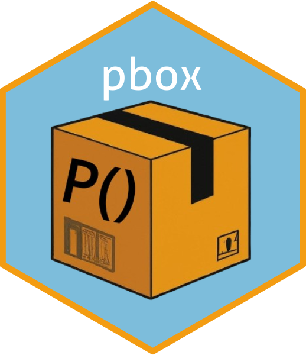

# PBOX  

### Version 0.0.0.9000


<!-- badges: start -->
[](https://github.com/bcgov/repomountie/blob/8b2ebdc9756819625a56f7a426c29f99b777ab1d/doc/state-badges.md)
[](https://opensource.org/licenses/GPL-3.0)
<!--[](https://github.com/bcgov/bcmaps/actions)
[](https://cran.r-project.org/package=bcmaps) [](https://CRAN.R-project.org/package=bcmaps) 
<!-- badges: end -->


## Overview

The [pbox](https://github.com/athammad/pbox) R package is designed for risk assessment and management. It is an advanced statistical library that excels in exploring probability distributions within a given dataset. The tool offers a method to encapsulate and query the probability space effortlessly. Its distinctive feature lies in the ease with which users can navigate and analyze marginal, joint, and conditional probabilities while taking into account the underlying correlation structure inherent in the data. This unique capability empowers users to delve into intricate relationships and dependencies within datasets, providing a solid foundation for making well-informed decisions in the context of risk management scenarios. With pbox is straightforward to answer questions like:


-   What is the probability of experiencing extreme heat waves in Indonesia with temperatures above 32 degrees?

-   What is the probability of simultaneous extreme heat waves in Vietnam with temperatures above than 31 degrees and the average regional temperature being above than 26 degrees?

-   Given that the average regional temperature is 26 degrees, what is the probability of experiencing extreme heat waves in both Vietnam and Indonesia with temperatures above 33 degrees?


## Features
**Train, Test & Evaluate in one go**

Use `syntCFtrain()` and `syntCFmetrics()` to quickly train quantile Random forests with block bootstrapping and compute several evaluation metrics (RMSPE, MAPE,R2) including scoring rules metrics (interval score,sharpness, underprediction, overprediction).

**Estimation**

Estimate the effect of the treatment with `syntCFest()` using difference-in-difference (DID) to account for any systematic error in the trained model.

**Plotting**

`syntCFplot()` creates beautiful and easily customizable `ggplot2` plot to visualize to visually compare the factual and the counterfactual time series.


## Installation

<!-- 
You can install `syntCF` from CRAN:
```{r, echo=TRUE, eval=FALSE}
install.packages("syntCF")
```
 -->
 
To install the development version of the `syntCF` package, you need to install the `remotes` package then the `syntCF` package.

```{r, echo=TRUE, eval=FALSE}
install.packages("remotes")
remotes::install_github("athammad/syntCF")
```

## Vignettes

After installing the package you can view vignettes by typing `browseVignettes("syntCF")` in your R session. 
<!--  Or you can check this [document](https://github.com/athammad/syntCF/doc/syntCF_vignette.html) where you will find an example with simulated data and method references.
 -->

## Getting Help or Reporting an Issue

To report bugs/issues/feature requests, please file an [issue](https://github.com/athammad/syntCF/issues/).


## Cite
